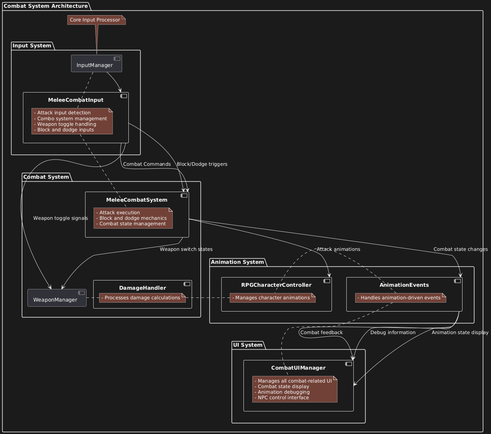

# Combat System Overview

## Introduction
This combat system is designed for action RPG games, featuring a dynamic melee combat system with combo mechanics, weapon switching, and animation-driven gameplay.

## Key Features
- Combo-based combat system
- Weapon switching mechanism
- Block and dodge mechanics
- Animation-driven hit detection
- Modular design for easy extension

## System Requirements
- Unity 2022.3 or later
- RPG Character Mecanim Animation Pack
- TextMeshPro

## Architecture Overview

## Core Components
1. Combat System
   - Handles combat logic and damage calculations
   - Manages combat states and transitions
   - Processes hit detection and damage application

2. Input System
   - Processes player inputs
   - Manages combat commands
   - Handles input buffering

3. Animation System
   - Controls character animations
   - Manages animation states
   - Handles animation events

4. UI System
   - Displays combat information
   - Manages combat feedback
   - Provides debug information

