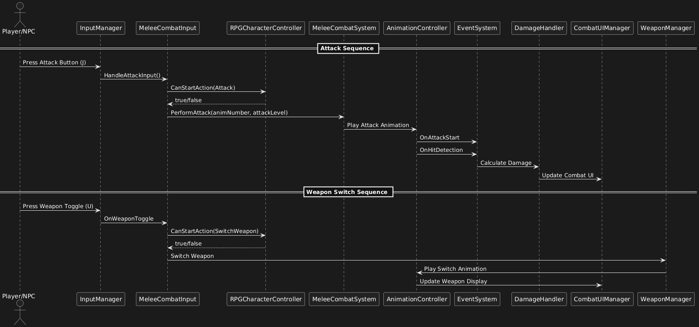

# System Interaction Documentation

## Overview
This document details how different systems interact within the combat framework.

## Core Interaction Flows

### Attack Flow
1. Input System
   - Detects attack input
   - Validates input state
   - Sends attack command

2. Combat System
   - Receives attack command
   - Validates combat state
   - Determines attack type
   - Triggers animation

3. Animation System
   - Plays attack animation
   - Triggers hit detection events
   - Manages animation states

4. UI System
   - Updates combat UI
   - Displays attack feedback

## Sequence Diagrams

## Event System
### Key Events
- OnAttackStart
- OnHitDetection
- OnDamageDealt
- OnWeaponSwitch
